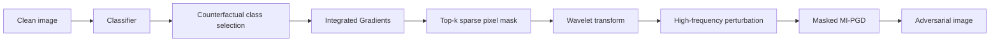

# Counterfactual-Oriented Sparse Frequency Attack (CoSFA)

A white-box adversarial attack framework that combines **counterfactual decision modeling**, **Integrated Gradients-based sparse pixel selection**, **high-frequency wavelet perturbations**, and **masked momentum iterative optimization** to generate imperceptible adversarial examples.

## Repository Overview

This repository contains the implementation of the CoSFA attack pipeline used in the thesis *From Gradients to Reality: Practical White-Box Adversarial Attacks*.

The project focuses on:

* sparse, decision-aware adversarial perturbations
* frequency-domain optimization
* perceptual fidelity preservation
* transferability analysis across multiple image classifiers

## Project Structure

```text
.
├── Cosfa_attack.py
├── Optimization_and_transferability.py
└── README.md
```

## Core Ideas

CoSFA is built around four main stages:

1. **Counterfactual class selection** — identify the nearest competing class in logit space.
2. **Pixel attribution** — compute Integrated Gradients and keep only the top-
   *k* most important pixels.
3. **Wavelet-domain perturbation** — restrict adversarial energy to high-frequency
   subbands to preserve low-frequency structure.
4. **Masked MI-PGD optimization** — optimize the perturbation under an (\ell_\infty)
   budget while respecting the sparse mask.

## Architecture

The architecture illustrated in the thesis can be summarized as the following pipeline:



### Visual Overview

The thesis figure on the methodology page shows the complete CoSFA pipeline, including:

* counterfactual class selection
* gradient accumulation for attribution
* top-*k* perturbation selection
* wavelet transformation
* perturbation projection and adaptive search

The results figure in the thesis shows that clean images are converted into adversarial examples that preserve visual appearance while changing the predicted class.

## Code Modules

### `Cosfa_attack.py`

Implements the main CoSFA attack pipeline, including:

* dataset loading
* wavelet transform utilities
* Integrated Gradients mask generation
* masked momentum iterative PGD attack
* model loading for ResNet-50, ConvNeXt-Base, ViT-B/16, and VisionMamba-Small
* metric computation and visualization helpers

### `Optimization_and_transferability.py`

Contains the evaluation and transferability analysis pipeline, including:

* ImageNet-Mini dataset loading
* SSIM / PSNR / LPIPS / MUSIQ / FID-style quality metrics
* optimization-step analysis
* cross-architecture transferability experiments
* adversarial result logging and visualization

## Dataset

The experiments use **ImageNet-Mini**.

### Dataset link

Use the dataset link provided in the thesis or project documentation here:

**Dataset:** `PASTE_DATASET_LINK_HERE`

### Dataset layout

```text
imagenet-mini/
└── val/
    ├── class_1/
    ├── class_2/
    └── ...
```

The loaders in the code also support a Kaggle fallback path when the local dataset directory is unavailable.

## Models Evaluated

* ResNet-50
* ConvNeXt-Base
* ViT-B/16
* VisionMamba-Small

## Metrics

The repository evaluates adversarial quality using:

* Attack Success Rate (ASR)
* (\ell_\infty) perturbation budget
* (\ell_2) distance
* PSNR
* SSIM
* LPIPS
* FID
* MUSIQ

## Installation

```bash
pip install torch torchvision timm pywt lpips pyiqa scipy scikit-image pandas matplotlib tqdm pillow
```

## Usage

### Run the CoSFA attack

```bash
python Cosfa_attack.py
```

### Run optimization and transferability analysis

```bash
python Optimization_and_transferability.py
```

## Output Examples

* clean vs adversarial image comparisons

**From Gradients to Reality: Practical White-Box Adversarial Attacks**

## GitHub Repository

`https://github.com/Aman7747/Mtech_Thesis_Project`

